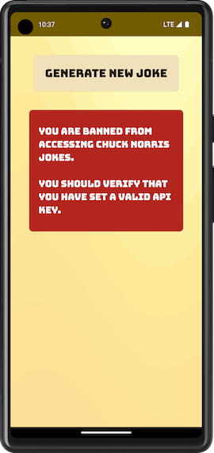

# Endless Chuck Norris Jokes To Make You Laugh

## Example project for Master CI/CD for Android Developers Course

This project is used for mastering App Center as CI/CD for Android projects. While creating it for the purposes of this course, I tried to use the latest and greatest technologies from Android ecosystem. Below you can find project tech stack:

### Includes:

- [MVVM architectural pattern](https://developer.android.com/topic/libraries/architecture/viewmodel)
- [Dependency injection with Hilt](https://developer.android.com/training/dependency-injection/hilt-android)
- [Jetpack Compose UI](https://developer.android.com/jetpack/compose)
- [Material Design 3](https://m3.material.io/develop/android/mdc-android)
- [Downloadable Fonts](https://developer.android.com/develop/ui/views/text-and-emoji/downloadable-fonts)
- [Flow](https://developer.android.com/kotlin/flow)
- [Retrofit](https://square.github.io/retrofit/)
- [Moshi](https://github.com/square/moshi)

### App structure:
App itself is super easy since it only fetches jokes about Chuck Norris from the free API https://api.chucknorris.io/. I tried to divide layers properly so there are [api](https://github.com/stevan-milovanovic/Chuck-Norris-Jokes/tree/dev/app/src/main/java/rs/smobile/chucknorrisjokes/data/api), [repository](https://github.com/stevan-milovanovic/Chuck-Norris-Jokes/tree/dev/app/src/main/java/rs/smobile/chucknorrisjokes/data/repository), [viewmodel](https://github.com/stevan-milovanovic/Chuck-Norris-Jokes/tree/dev/app/src/main/java/rs/smobile/chucknorrisjokes/viewmodel) and [ui](https://github.com/stevan-milovanovic/Chuck-Norris-Jokes/tree/dev/app/src/main/java/rs/smobile/chucknorrisjokes/ui) packages. Besides that [di](https://github.com/stevan-milovanovic/Chuck-Norris-Jokes/tree/dev/app/src/main/java/rs/smobile/chucknorrisjokes/di) package holds modules for dependency injection and [analytics](https://github.com/stevan-milovanovic/Chuck-Norris-Jokes/tree/dev/app/src/main/java/rs/smobile/chucknorrisjokes/analytics) package holds logic for app analytics.

***Note***: App secrets (such as api key and app center key) are hidden in app-settings.properties file which should be created in project root directory. For CI builds these secrets have to be added as environment variables.

### Test Coverage:
Project is covered with both [UI](https://github.com/stevan-milovanovic/Chuck-Norris-Jokes/tree/dev/app/src/androidTest/java/rs/smobile/chucknorrisjokes/ui) and [Unit](https://github.com/stevan-milovanovic/Chuck-Norris-Jokes/tree/dev/app/src/test/java/rs/smobile/chucknorrisjokes/viewmodel) tests.

## CI/CD

### Build status:

#### Dev:

#### Test:

#### Master:

License
--------

Copyright 2017 The Android Open Source Project, Inc.

Licensed to the Apache Software Foundation (ASF) under one or more contributor
license agreements.  See the NOTICE file distributed with this work for
additional information regarding copyright ownership.  The ASF licenses this
file to you under the Apache License, Version 2.0 (the "License"); you may not
use this file except in compliance with the License.  You may obtain a copy of
the License at

http://www.apache.org/licenses/LICENSE-2.0

Unless required by applicable law or agreed to in writing, software
distributed under the License is distributed on an "AS IS" BASIS, WITHOUT
WARRANTIES OR CONDITIONS OF ANY KIND, either express or implied.  See the
License for the specific language governing permissions and limitations under
the License.
